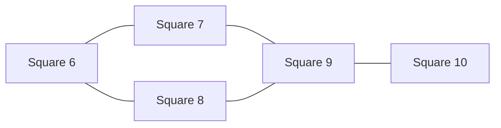

# Recovered simplification checkpoint — 3 October 2026

The delivered whole-proof source closure contains **494,346 physical Lean lines** in **7,514 local modules**, including all reached certificate data. Lean and Mathlib sources are excluded. The full assembled theorem has **not** passed kernel verification. The report below records the recovered investigation; its paths refer to the earlier research workspace. The delivered source manifest and handoff take precedence over its intermediate counts and live-run descriptions.

# Simplifying the eleven-square optimality proof

Draft prepared for the fully restored source at `c82cff63e48b2d3f2da60cb998bbab48e557c012`. This records the mathematical changes, concrete source replacements, and verification boundaries. Certificate generation has stopped at a concrete source candidate; resource checks and kernel replay are still running. This is not a final acceptance report.

The largest new mathematical gains come from proving a disjunction directly: a square captures one of two complementary points, so no fine staircase of boxes is needed to decide which point. A second gain keeps wall distance coupled to the actual rotation angle instead of bounding them independently. Both ideas already have kernel-accepted examples replacing roughly one hundred thousand original tree nodes by a single leaf. The common forty-row local cone and the full convex collision region then simplify two other major branches. These are claims about this proof and its certificates, not claims of novelty in the mathematical literature.

## 1. What must actually be proved

The problem allows every square to rotate independently. Unit squares have disjoint open interiors, their closed boundaries may touch, and their closed squares must fit inside the container. Replacing these conditions by separated centers, assuming a common orientation, or making touching illegal would change the theorem.

The proof has three essential parts:

1. **Construction:** exhibit the eleven-square packing at the proposed side length \(T\).
2. **Global exclusion and capture:** every hypothetical packing in a smaller square is either excluded by one of the finite geometric certificates, or can be normalized and relabeled into a neighborhood of the construction.
3. **Local obstruction:** a packing in that neighborhood cannot have a smaller container.

The original proof obtains the last point through complete local isolation: all 33 displacement coordinates vanish. The final lower-bound argument actually needs less: recovering the construction's right-wall corner \((T,0)\) in a centered container already gives \(T\le S\). Our generic global interface makes this dependency explicit. It does not discharge the substantial global exclusion and capture premises.

Here \(T\approx3.8770835900228141773\); its exact algebraic definition and closing-contact meaning appear in the construction section below. The global reduction has 2,184 center-cell configurations after identifying half-turn pairs:

| Family | Configurations | Role |
|---|---:|---|
| Baseline | 1,931 | Published field and generic exclusions |
| Prior support | 76 | Ownership-promotion exclusions |
| Returned/T03 | 173 | The other ownership-promotion exclusions |
| Candidates \(\{438,999,1462,1659\}\) | 4 | Symmetry reduction, then capture near the construction |

The three exclusion families total 2,180. Symmetry reduces the remaining candidates to case 438; its extended capture argument places the packing in the local rectangle. The global certificates use a rational side just above \(T\), keeping every cell and angle boundary closed. A successful T03 case or finite leaf therefore settles one piece of this architecture, not the whole optimality theorem.

There are two different goals in the simplification work. A mathematical improvement replaces many cases by a stronger geometric lemma. A structural improvement proves a repeated operation once and makes generated instances smaller. Both help, but a smaller encoding by itself is not a shorter mathematical argument.

## 2. Baseline and evidence standards

The current checkout is `11SquaresFull`. All pinned generated sources have been materialized. A count made before restoration was misleading because it omitted 289 generated imports.

| Original source census | Distinct local modules | Physical Lean lines |
|---|---:|---:|
| Import closure of `ElevenSquare.Optimality` | 15,440 | **2,681,349** |
| All original active local source, including alternatives outside that closure | 23,956 | **3,354,087** |

The counts include blank lines, comments, and generated data. They exclude the fixed Lean/Mathlib dependencies. The frozen census additionally saw six newly added experimental modules containing 502 lines; those are excluded from the “all original” figure. The final theorem's closure is the meaningful denominator for a proposed 500,000-line replacement. Standalone task closures overlap and must not be added.

Source: `audit/README.md` (`../audit/README.md`), `materialized-original-closure.json` (`../audit/materialized-original-closure.json`), and `measure_closure.py` (`../audit/measure_closure.py`).

The current source has an empty admission inventory, unlike the older snapshots discussed in the historical appendix. That is evidence about source assembly, **not** evidence that a complete new global theorem has finished kernel checking. The current pinned toolchain is Lean 4.34.1 with Mathlib `d13f23b723b8a846827a245b89c10fc7d3f11612`.

We use four distinct evidence levels:

| Level | What it establishes |
|---|---|
| Kernel accepted declaration | The named Lean declaration compiled and its axiom audit contains only `propext`, `Classical.choice`, and `Quot.sound`, or a subset. |
| Exact arithmetic replay | Integer, rational, or algebraic checks passed against authenticated source data. This does not replace a Lean proof. |
| Concrete replacement source | The complete candidate module is written, but may still be waiting for compilation. |
| Conditional geometric lemma | The conclusion is proved under stated premises; the packing-to-premise bridge may remain unfinished. |

The authoritative current receipts are in `runtime/accepted-pilots-current.json` (`../runtime/accepted-pilots-current.json`), individual verifier receipts, and `runtime/status.json` (`../runtime/status.json`). A successful target printed before a subsequent module error is not treated as an accepted module.

## 3. Geometric rules that remove large box trees

### 3.1 Complementary capture: prove the alternatives together

Let a unit square have center \(z\) and orthonormal axes \(e,f\). Membership of a point is equivalent to four inequalities. Suppose three of them hold for an existing point \(p\), and three hold for another existing point \(q\); the two missing sides face in opposite directions. After choosing the sign of \(e\), the missing inequalities are

\[
e\cdot z\le e\cdot p+\tfrac12,
\qquad
-e\cdot z\le\tfrac12-e\cdot q.
\]

If \(e\cdot(q-p)\le1\), their right sides sum to a nonnegative number, while their left sides sum to zero. The missing inequalities cannot both fail. Thus **the square contains \(p\) or \(q\)**. The stronger sufficient condition \(\|q-p\|\le1\) works for every orientation, by Cauchy–Schwarz. Equality is allowed; touching and closed split ties are preserved.

The old tree assigns one captured point to each small center/angle box. When two points exchange roles across a tilted facet, this creates a staircase of boxes. The lemma removes the need to resolve that exchange boundary. For two multi-group options, certify every other group as before, then apply the lemma to the two exceptional groups. Whichever exceptional point is captured completes one whole original option. Neither new points nor new ownership assumptions are needed.

In the original integer half-angle chart, put

\[
A(t)=2(R^2-t^2),\quad B(t)=4Rt,\quad D(t)=R^2+t^2.
\]

For one pair of opposite sides, the offset sum is the quadratic

\[
H(t)=2Q D(t)+A(t)(p_x-q_x)+B(t)(p_y-q_y).
\]

Three degree-two Bernstein coefficients certify \(H\ge0\) over the closed angle interval. The ordinary remaining sides use the exact two-facet bounds described below. Alternatively, the integer inequality \((q_x-p_x)^2+(q_y-p_y)^2\le Q^2\) replaces the angle-dependent offset test completely.

The concrete original part `F25/Cov10P196` has **99,337 decoded tree nodes**. A single complementary leaf proves the **identical original `CovF` proposition**. The points are

\[
p=(8340262464,10892682048),\qquad
q=(12373993966,12367091968),\qquad Q=4294967296.
\]

Their squared-distance margin is the positive integer
\(Q^2-\|q-p\|^2=1869631287969212\). The generic complementary and distance lemmas, their tree soundness theorem, and `ComplementaryF25Pilot.covered` are kernel accepted. Bulk generated replacements remain pending finite kernel checks. The full derivation and source bindings are in `COMPLEMENTARY_CAPTURE.md` (`../geometry/COMPLEMENTARY_CAPTURE.md`).

[Illustration omitted; exact certificate data are included in the checkpoint.]

*An exact-data slice at one rational angle, approximately \(20.7447^\circ\): 352 actual old center cuts versus the two capture regions covering the full F25 root box. This figure illustrates a fixed-angle slice; the certificate proves the entire closed angle interval. The source is `draw_complementary_capture.py` (`../geometry/draw_complementary_capture.py`).*

### 3.2 Keep wall distance and angle coupled

A rotated square's center must move away from a container wall by an amount determined by that **same** angle. Replacing the angle-dependent half-width by its minimum over an interval loses this relation.

For \(0\le t\le R\), write

\[
c(t)=\frac{R^2-t^2}{R^2+t^2},\quad
s(t)=\frac{2Rt}{R^2+t^2},\quad
w(t)=\frac Q2(c(t)+s(t)).
\]

A left wall gives \(x\ge w(t)\). Clearing the positive denominator turns each wall or static cell condition into a halfplane with a quadratic right side. For fixed source normals \(u,v\) and a target normal \(n(t)\), set

\[
d=\det(u,v)>0,\quad
\alpha(t)=\det(n(t),v),\quad
\beta(t)=\det(u,n(t)).
\]

The identity \(\alpha u+\beta v=dn\) is exact. Nonnegative \(\alpha,\beta\) allow a positive combination of the two source inequalities. With source numerators \(U,V\) and target right side \(C\), the remaining test is one quartic:

\[
2(R^2+t^2)dC(t)-\alpha(t)U(t)-\beta(t)V(t)\ge0.
\]

Five degree-four Bernstein coefficients certify it throughout the interval. This is exact parametric linear duality, rather than independent interval estimates.

For original `F05/Cov0P41`, **93,089 decoded nodes become one correlated leaf**, again proving the **identical original `CovF` proposition**. Only the left wall and three center-box sides are needed; all fifteen cell halfplanes can be omitted in this instance. Its original three groups require just two distinct selected points. The generic quartic, support, physical wall, and tree soundness theorems and the actual `CorrelatedF05Pilot` are kernel accepted. An independent rational implementation also derives the normals and Bernstein coefficients and checks the source bindings. See `CORRELATED_WALL_REVIEW.md` (`../geometry/CORRELATED_WALL_REVIEW.md`).

### 3.3 Preserve the correct interface when reducing target sets

| Concrete result/interface | Stage contract | Final physical contract |
|---|---|---|
| Complementary F25 pilot | Exactly the original options, points, region, and `CovF` | A finite stage; the whole field remains pending |
| Correlated F05 pilot | Exactly the original options, points, region, and `CovF` | A finite stage; the whole field remains pending |
| Conditional S330 pilot (exact replay; kernel check pending) | Same geometric domain, but the reduced target option list | Requires the corresponding rewritten case data and ownership chain |
| Full `Reduced2135.Main.excluded` | Seventeen strengthened stages with reduced target data | Exactly the original `CaseExcluded (maskAt 2135)`; fully accepted |

The distinction matters: a five-point reduced target stage cannot simply be substituted for an original stage promising many more points. Backward dependency analysis first proves that later steps use only those five points, then rewrites the complete ownership trace. The composite source package keeps this data/trace change together. Completed combined-capture stages may replace earlier strengthened stages only after exact comparison of every reduced data definition and option order.

### 3.4 Satisfy a whole option without deciding every point separately

An option consists of several groups; every group needs at least one captured
point. Choose one existing point from each group of option A, making a list
\(P\), and likewise choose a list \(Q\) for option B. The following elementary
implication combines many complementary pairs at once:

\[
(\forall p\in P,\ \forall q\in Q,\ C(p)\lor C(q))
\quad\Longrightarrow\quad
(\forall p\in P,\ C(p))\lor(\forall q\in Q,\ C(q)).
\]

If every point of \(P\) is captured, the first option succeeds. Otherwise, one
uncaptured point of \(P\), paired with each point of \(Q\), forces the second
option to succeed. Empty options and repeated points cause no exception.

The geometry is the same as complementary capture: unresolved points on one
side lack a facet with normal \(e\), and those on the other lack the opposite
facet. If the missing upper bounds are \(a_p\) and \(b_q\), all cross-pair
conditions \(a_p+b_q\ge0\) suffice. This avoids subdividing the domain to decide
which individual points exchange roles. No new points or ownership assumptions
are introduced.

For original **U2P C221 S10**, the original 16,917-node cover became 7,479 nodes
with the earlier combined rule, then **2,125 nodes** with this rule. The stage
source changes from 34 to 16 physical lines, and from 190,543 to 76,927 bytes;
the additional generic checker has 191 lines. An independent exact replay
checked all 220 new leaves and all 3,520 selected cross pairs, including an
option with eight unresolved points. The emitted stage retains the **identical
original `CovF` proposition**. The generic theorem is kernel accepted. The first complete 2,125-node
finite pilot exhausted memory, so that finite instance and the generated
family are not yet kernel accepted. A separate fast checker preserves the
same encoded certificate: it checks each selected point once, then checks
only the remaining complementary gaps between pairs. Its soundness reduces
to the accepted original leaf theorem. This factored generic checker is now kernel accepted, and all 220 actual new leaves pass its exact predicate independently; the full finite resource pilot is pending. A separate conditional C1464 pilot uses reduced targets, so the
interface distinction in §3.3 still applies. See
`MULTIGROUP_COMPLEMENTARY_REVIEW.md` (`../geometry/MULTIGROUP_COMPLEMENTARY_REVIEW.md`).

## 4. Local rigidity: remove the branch dependence before proving rigidity

### 4.1 Original local certificate

The original proof represents eleven squares by 22 center displacements and eleven angle displacements. Separating-axis choices give 128 local branches. Each branch supplies 42 necessary linearized inequalities with quadratic error bounds. Each of 33 coordinates, with either sign, then has a nonnegative dual certificate: **128 × 33 × 2 = 8,448 duals**.

This is a sound computational strategy, but the branch choices contain much more information than the rigidity argument needs.

### 4.2 One common cone with forty rows

At each of the five parallel contacts, two common gradient inequalities can be obtained as convex combinations of either owner's available inequalities. Thus the owner choice can be removed *before* solving the dual problem. Twenty convex identities, checked in all 33 coordinates, give **660 exact polynomial coefficient identities**. Geometrically, only two angular coefficients change at each parallel contact; the translation coefficients agree. Of the 660 equalities, 620 have identical gradient classes. The final formal proof reduces the rest to ten scalar interpolation identities. The three nontrivial weights have the simple form \(1/2-\beta_1\), \(1/2+\beta_2\), and \(1/2-\beta_3\), where the \(\beta_i\) are angular lever arms; their bounds express \(|\beta_i|\le1/2\). The source's degree-seven representatives obscure this interpolation between endpoints of unit-length intervals. Two redundant corner-contact rows can also be discarded.

Every original branch therefore implies the same forty necessary inequalities. If two rows have lower bounds \(-K_1\tau^2/2\) and \(-K_2\tau^2/2\), their convex combination has the lower bound \(-\max(K_1,K_2)\tau^2/2\). This preserves closed contacts, alternate separating axes, and the original one-sided Taylor estimates.

The result is **128 systems → one forty-row system**, and **8,448 duals → 66 duals**. The dual weights can all have denominator 1000. The exact maximum domination ratio is

\[
\frac{1732516775872644050197}{1792490200000000000000}
\approx 0.96654184<1.
\]

A second simplification uses the actual rectangle norm. For coordinate radii \(r_k\), a residual vector \(e\) costs

\[
\sum_k r_k|e_k|,
\]

rather than the weaker \((\max r_k)\sum_k|e_k|\). This is the elementary dual norm of the rectangle, and removes needless numerical pessimism.

The final contradiction is short. Put
\(\tau=\max_k |h_k|/r_k\le1\), and suppose \(\tau>0\). Choose a maximizing
coordinate \(j\) and the sign \(\sigma\) for which
\(\sigma h_j=-\tau r_j\). Its nonnegative dual combination has gradient
\(\sigma e_j+e\), residual cost \(E=\sum_k r_k|e_k|\), and nonnegative combined curvature
bound \(D\). The forty necessary inequalities imply

\[
-\tfrac12D\tau^2\le \sigma h_j+e\cdot h
\le-\tau r_j+\tau E.
\]

Consequently \(r_j\le E+D/2\), whereas the checked strict margin is
\(E+D/2<r_j\). Thus \(\tau=0\), so every displacement vanishes. The large
coordinate certificate tables serve only to establish these 66 strict scalar
margins for the one common system.


The replacement includes `LocalAlias{Core,Cover}`, the fixed-contact witness checker, and `LocalBranchCover`. Its geometry adapter exposes the existing branch cover and polynomial-gradient Taylor bounds directly, so obsolete packet definitions and all 128 old dual-data tables also leave the new import path. The actual theorem in `LocalCommonIsolation.lean` (`../../11SquaresFull/ElevenSquare/Simplified/LocalCommonIsolation.lean`) has the original packing premise:

```lean
(h : Displacement)
(hrect : InRectangle focusedRadii h)
(hpack : LocalFeasible T constructionSquare h) : h = 0
```

The **complete actual local replacement is now kernel accepted**. Both
`packing_common_rows` and `construction_locally_isolated` in
`LocalCommonIsolation` were accepted with only the standard three axioms, after
all 66 dual certificates, the real residual/margin bounds, all twenty
owner-convexification identities, all 21,504 alias obligations, and the original
nonlinear branch-cover/Taylor adapter were checked. Its source closure has
**46,651 lines versus 269,685** for `Pending.S08_ExactPacket`: **223,034 lines
removed** for these particular local closures. None of the 128 old
`CertificateInteger` modules occurs in the new route. Global downstream
integration and the whole optimality theorem still require their own replay;
local acceptance is not full-proof acceptance.

An additional preserving abstraction replaces approximately 26,000 lines of handwritten alias witnesses by generic `List.any` soundness and 32 kernel checks of 16 × 42 cases. All 21,504 finite alias obligations remain; this is proof factoring, separate from the mathematical 128 → one cone reduction. The complete `LocalAliasCover` and the resulting `LocalBranchCover` are now kernel accepted.

The intended downstream integration changes the import and theorem reference in `Tasks/T07/LocalRigidity.lean`. The old `exact_local_packet_exists` declaration can remain available for legacy audits without remaining on the final theorem's import path. See `local/README.md` (`../local/README.md`).

### 4.3 Two force balances instead of all coordinate duals

The stronger geometric argument has also been derived and exactly replayed against the current source. It has two positive force balances, a connected graph of five tilted-square contacts, eleven rational coefficient inequalities, and elementary propagation of centers.

Using the source's zero-based square labels, the angular energy has eleven terms: the six outer magnitudes \(|\theta_0|,\ldots,|\theta_5|\), and the five relative angles on this graph:



Vanishing graph energy makes all five inner angles equal. The two balances, with opposite loads on a common rotation, then force that remaining angle to zero. The diagram records contact connectivity, not geometric positions or distances.

The key analytic observation is that a separating gap is affine in translations. Its Taylor remainder has **no translation-squared term**: only angle-squared and translation-times-angle terms occur. Consequently every error can be bounded by a small neighborhood radius times an angular energy. A positive combination of contact and wall inequalities penalizes the six outer angles and the differences along the tilted contact graph. The two force balances control the remaining common tilted angle in both directions.

After collecting terms, all eleven strict margins exceed \(1/100\); the smallest is \(53/5000\). The abstract energy contraction forces every angle to vanish. Eleven wall anchors and eleven contact equations then force all 22 translations to vanish, by following the contact graph. There is no matrix inverse or 66-coordinate dual certificate in this endgame.

The earlier exact proof covers the uniform closed box

\[
|\delta x_i|,|\delta y_i|\le 1/250,
\qquad |\delta\theta_i|\le 7/1000.
\]

An independent estimate excludes all 88 unavailable source features there, each with gap less than \(-3/1000\). The contraction lemma and the full conditional endgame (margins, `angles_zero`, and `centers_zero`) are kernel accepted with only the standard axioms. The concrete endgame is in `LocalForceGeometry.lean` (`../../11SquaresFull/ElevenSquare/Simplified/LocalForceGeometry.lean`). **Its hypotheses still include the energy inequalities and contact equations. The complete Lean bridge from arbitrary nearby packings to those hypotheses is unfinished.** It must not yet be described as a kernel-accepted replacement for the concrete local theorem.

This is the mathematical sequence **8,448 → 66 → zero coordinate duals**. These are successive alternative proofs, not additive source reductions.

### 4.4 A preserving fallback: factor the old integer checker

Independently of the geometric reduction, the 128 original integer-certificate modules repeat the same column transport and residual/mass calculation. A 43-line generic checker proves exactly the original predicates. All original input numbers and all theorem statements remain unchanged.

The 128 source files contain 194,807 lines. Their dense generic replacements contain 2,304 lines, plus the shared checker. An exact replay verified all 8,448 original checks; the residual margin can be zero, so preserving non-strict residual bounds matters. The curvature inequalities retain strict margins.

The shared checker and the first/last actual branch-0 duals are kernel accepted. The entire 128-file replacement has not been compiled or applied. It remains a valid fallback direction, but retains all 8,448 arithmetic checks and is superseded mathematically by the common-cone proposal. A sparse variant is another representation of this same alternative, not an additional saving.

## 5. Global search: strengthen what one geometric leaf can establish

### 5.1 Keep the actual cell polygon

A square's center is constrained by both a rectangular search box and its geometric cell halfplanes. The old finite checker can reject a box that misses the cell, but otherwise some point tests use all four rectangle corners, including corners outside the cell. This creates avoidable subdivisions.

The new polyhedral checker tests the intersection polygon itself. A planar linear implication needs only two bounding facets. For

\[
u\cdot x\le a,\quad v\cdot x\le b,
\quad D=\det(u,v)>0,
\]

put \(A=\det(w,v)\), \(B=\det(u,w)\). If \(A,B\ge0\) and \(Aa+Bb\le Dc\), then \(w\cdot x\le c\), because \(Dw=Au+Bv\). The certificate stores two facet indices; exact integer determinants reconstruct the coefficients.

At a leaf, all selected points share twelve normal directions: three angle Bernstein parameters times four square facets. Only offsets change. Consequently the same twelve facet pairs can be shared across all point groups at that leaf.

Two further accepted rules improve these leaves. First, the unit square's half-width is
\(w(u)=(1+2u-u^2)/(2(1+u^2))\). For a nonnegative proposed bound \(w_0\), the inequality \(w(u)\ge w_0\) is equivalent to

\[
(1-2w_0)+2u-(1+2w_0)u^2\ge0.
\]

This quadratic is concave, so checking its two interval endpoints suffices. The exact endpoint minimum gives a stronger static wall bound before the later correlated-wall rule keeps the full angle dependence. Second, an empty center polygon can be certified by three nonnegative facet multipliers: their weighted normals cancel, while their weighted offsets sum to a negative number. Any putative center would then imply \(0<0\). This is a small exact planar Farkas certificate, not an assumption that a thin-looking polygon is empty.

Case 2135 gives a concrete comparison using the same base-4096 encoding and the original 1,500-leaf chunk budget:

| Seventeen coverage stages: sixteen promotions and terminal S16 | Tree nodes | Canonical source lines | Bytes |
|---|---:|---:|---:|
| Original | 299,935 | 1,017 | 7,608,508 |
| Rectangle pruning | 140,587 | 573 | 2,610,243 |
| Polyhedral pruning | 67,487 | 397 | 1,597,105 |

These counts exclude shared generic infrastructure. The new checker preserves the original closed `CovF` contract and the original scale bridge to strict ownership. The rectangle-pruned first stage, generic `PolyhedralPoint`/`PolyhedralTree`, the actual 535-node `Poly2135S0.cover`, and generic empty-polygon and stronger endpoint-wall checkers are kernel accepted. The full generated families remain pending verification.

A complete strengthened case is now kernel accepted: `Simplified.Reduced2135.Main.excluded : CaseExcluded (maskAt 2135)`, with the original physical packing meaning, all sixteen promotions and the terminal stage, the reduced owned-point data, and the initialized ownership chain. Backward demand analysis retains only the points actually used as later triangle corners: 255 target points become 155. Stronger endpoint wall bounds then give **299,935 → 38,493 nodes**, **1,017 → 342 cover lines**, and **7,608,508 → 804,627 cover bytes** for those seventeen coverage stages, before shared infrastructure/Data/Main. This is an unconditional actual-case theorem with only the standard axioms.

Smaller variants are still producer-only. Adding the correct empty-polygon rule yields 35,105 nodes; iterating unused-triangle removal gives 33,927 nodes and 135 target points. The latter extra step removes 1,178 nodes and 46,402 bytes relative to the same empty-aware one-pass baseline, but **zero additional cover lines** under the fixed chunk budget. Its byte/node saving must not be mislabeled as a line-count improvement.

Source and generator details: `compression/README.md` (`../compression/README.md`), `PolyhedralPoint.lean` (`../../11SquaresFull/Sqpack/S11Opt/Simplified/PolyhedralPoint.lean`), `PolyhedralTree.lean` (`../../11SquaresFull/Sqpack/S11Opt/Simplified/PolyhedralTree.lean`).

### 5.2 Reuse identical geometric problems across different case traces

Different combinatorial cases often arrive at the same geometric coverage problem. The census finds 6,688 stage problems but only 3,261 distinct ones. There are 3,427 duplicate stage modules in 606 groups.

One representative cover is retained per group. Each other stage becomes a short wrapper using the same public `CovF` statement and a finite monotonicity check on its options. The proposed wrappers replace 215,904 lines by 37,697. These numbers cannot be added to polyhedral savings: the representative may itself use the new polyhedral certificate, and duplicate copies must be replaced only once.

A further source-only step uses the representative cover directly inside each `Main` proof. It avoids importing a separate eleven-line alias module for each reused cover. The current `inline-shared.json` records this combined rewrite; its small added `Main` expressions must be counted together with the detached wrappers, not as an independent mathematical reduction.

The wrapper source is staged in `compression/shared-staged` (`../compression/shared-staged`); `shared-coverage.json` (`../compression/shared-coverage.json`) authenticates every source and output. The generic `CoverageMonotone` lemma and actual `SharedCoveragePilot` are accepted; the complete family remains pending kernel replay.

### 5.3 Batch ownership instead of repeating every triangle corner

Each promotion uses triangles whose three vertices are already owned by the same earlier square. Existing proofs repeatedly list the three corner memberships for every triangle. The generic `OwnedBatches.trianglesValidB_sound` theorem verifies the finite triangle list once from earlier owned batches.

The unconditional rewriting covers 240 `Main` modules and 5,773 promotion stages: 126,459 → 46,020 lines. The conditional variant first transports an earlier whole batch through `OwnedC.mono`, then performs the same finite check. It covers nine further modules, 1,605 stages, and 22,359 old triangle branches: **35,466 → 16,590 lines**, before its 46-line generic lemma. Every batch constructor occupies its own line; an earlier 11,511-line figure used denser formatting and is superseded.

A further 27 generic-case `Main` modules use the same abstraction: 498 stages and 10,930 → 4,158 lines.

These changes preserve ownership, all geometric data, and the public theorem statements. The generic unconditional and conditional ownership theorems and an actual 18-triangle C221 pilot are kernel accepted; the full rewritten families still need complete replay. See `ownership/rewrite-report.json` (`../ownership/rewrite-report.json`) and `ownership/CONDITIONAL.md` (`../ownership/CONDITIONAL.md`).

A further abstraction interprets the **whole ownership trace by one induction**. Each promotion is an explicit record containing its owner, triangle data, target points, and the original coverage proof. The generic checker verifies that every triangle's vertices occur in an earlier owned batch; its soundness theorem carries the ownership invariant through the entire list and applies the terminal exclusion. The 267 unconditional case candidates contain 6,421 promotion records, replacing **50,706 → 24,264 Main lines** after the earlier batching and canonical-cover rewrites. The generic induction itself is kernel accepted; the actual case pilot and whole family remain pending. All 81,207 triangle dependencies and 747,678 barycentric point identities were independently replayed during generation. The physical `notIn` and `excluded` contracts remain; the intermediate `ownN` helper declarations are replaced by the shared induction. See `generate_owned_trace.py` (`../ownership/generate_owned_trace.py`) and `trace-report.json` (`../ownership/trace-report.json`).

A separate reviewer then checked all 267 emitted cases against their native inputs, including all 3,427 canonical option weakenings, 3,261 direct covers, exact owner/box contracts, and every terminal triangle option. The removed `ownN` helpers have no external references in the native sources. These independent checks passed; their receipts are `trace-independent-audit.json` (`../ownership/trace-independent-audit.json`) and `own-helper-reference-audit.json` (`../ownership/own-helper-reference-audit.json`). They still do not replace the pending kernel checks of each concrete trace.

The same idea extends to **conditional ownership programs**. The program type
stores its current list of halfplane conditions. A promotion carries its exact
coverage theorem and explicit indices into earlier owned batches; a split
creates the two complementary conditions; a terminal applies exclusion. One
induction transports ownership through all three constructors. The concrete
producer preserves every original split and audits condition ancestry, sparse
batch indices, and all barycentric identities.

For the nine current conditional candidates, 1,552 promotions, sixteen splits,
and 25 terminal branches occupy **3,459 Main lines instead of 16,350**, before
the 83-line generic theorem. There is one explicit promotion record per line.
The producer checks 22,010 triangles and 390,214 barycentric point identities;
an external-reference scan confirms the removed ownership/branch helpers have
no external consumers. A separate reviewer reconstructed all nine emitted
program executions and all 1,577 exact conditioned coverage propositions,
without importing the producer. The generic conditional-program theorem is kernel accepted; these concrete
programs remain staged candidates, not yet kernel-accepted complete cases. The original physical `excluded` contracts and
all retained finite coverage propositions remain unchanged. See
`generate_conditional_trace.py` (`../ownership/generate_conditional_trace.py`) and
`conditional-trace-report.json` (`../ownership/conditional-trace-report.json`).

### 5.4 An orientation-free forbidden center region

A stronger geometric leaf avoids angle subdivision altogether. Suppose a convex set \(H\) consists of points strictly owned by another square in the scaled certificate coordinates. The target center cannot lie in

\[
H+\overline B(0,1/2).
\]

Indeed, a point of \(H\) within distance \(1/2\) of the target center lies in its closed unit square for every orientation. The original certificate uses the strict scale factor \(s=1-1/1048576<1\); scaling back places that point strictly inside the physical target square. Convexity keeps it strictly inside the owner too, contradicting disjoint interiors.

Both \(H\) and its radius-half enlargement are convex. It is therefore enough to give a witness for each of a rectangle's four corners, using the same owner. Each witness can use a different segment of the owned hull. Rational segment parameters reduce the check to an integer squared-distance inequality. The tree now subdivides centers only, in two dimensions.

The source search produced certificates for 25 of the 173 returned cases. Across the replaced suffixes, **241,743 old finite-tree nodes become 1,725 new two-dimensional nodes**, a 99.286% node reduction. Thirty promotion stages and 25 terminal stages disappear. The resulting finite source uses fewer bytes, 9,248,835 → 115,190, but its readable source has **2,007 → 2,291 lines before adapters**. This is a geometric simplification, not a claimed line-count reduction.

Generic barrier/tree theorems, the 47-node C2135 cover, and its conditional ownership bridge are kernel accepted. The fully initialized C2135 proof is queued; the other 24 full bindings are source candidates. All 25 finite certificates passed an independent exact integer verifier. The remaining 148 cases were not covered by this search. See `geometry/README.md` (`../geometry/README.md`) and `geometry/acceptance.json` (`../geometry/acceptance.json`).

### 5.5 U5: use the convex collision region instead of its triangle fan

In the difficult case-438 capture argument, let \(A\) be points strictly owned by one other square and \(B\) a strict core of the target square valid over the current angle interval. The center cannot lie in

\[
\operatorname{conv}(A)-\operatorname{conv}(B).
\]

The old checker represents this region through many triangle pieces. Those internal diagonals are unnecessary: the whole difference polygon is convex. The new `CTree.forbidHull` leaf certifies a convex polygon inside this forbidden difference set and proves that the current center polygon lies inside it using halfplane implications.

Each polygon must use a **single owner**. Combining points from different squares would invalidate the convex-ownership argument. Closed polygon boundaries are safe because ownership and the target core are strict.

The actual `P2/S137C0` pilot changes 4,654 nodes and 4,743 lines to 478 nodes and 567 lines. Its 199 new hull leaves replace the cover trees while preserving all 80 original subrow inputs. The generic checker extension and this pilot are kernel accepted. The completed 842-part candidate family has now passed an independent source-derived rational audit: 19,829 changed subrows were replayed and 7,487 unchanged subrows were preserved. The family changes 436,526 → 130,916 nodes and 493,920 → 188,310 physical lines. The line decrease, 305,610, is exactly the decrease in actual certificate-tree nodes, so it comes from removing geometry cases with the same one-constructor-per-line format. This is exact independent replay, not complete kernel acceptance of the family. See `u5/family-independent.json` and `u5/INDEPENDENT_REVIEW.md`.

A further decision-tree improvement chooses the split by comparing complete greedy continuations, instead of taking the first violated edge of one favored region. Exact overlap separators and a small lookahead retain the existing `CTree` checker. The completed 842-part family changes **130,916 → 105,832 nodes** and **188,310 → 163,226 lines**, removing another **25,084 actual nodes and lines**. Thus the combined original-to-optimized count is **436,526 → 105,832 nodes** and **493,920 → 163,226 lines**. All 842 files passed independent source-bound exact replay; this is not whole-family Lean acceptance. See `u5/OPTIMIZATION.md` (`../u5/OPTIMIZATION.md`).

Exact subtree sharing was also measured. Only 140 multi-node literal values repeat, and the largest has seven nodes. Even an optimistic bound ignoring all definition/import costs and double-counting nested savings is only 334 lines. Sharing the 3,600 repeated one-line leaves would save bytes but add physical lines. This rules out exact hash-consing as a major additional source reduction for this already optimized family.

A separate step abstraction invokes the existing proved step checker once, removing duplicate per-row packaging. The 459 proposed step modules have 37,675 → 11,849 lines and detach 842 per-row modules with 58,236 lines. Import closure, rather than summing those figures with hull savings, determines the combined result. See `u5/independent-mathematical-review.md` (`../u5/independent-mathematical-review.md`).

The monolithic step-check pilot exhausted the available memory; this is a
resource failure, not a counterexample to its arithmetic. A bounded alternative
checks eight rows at a time: 24,908 rows become 3,303 opaque checks across the
459 step modules. It preserves all original statements and every non-`step_ok`
proof body byte-for-byte. Its independent contract audit and generic helper have passed, but the first
width-eight route is not yet fully accepted: its later run exhausted memory in an unchanged promotion lemma, before diagnosing the new row checks. A bounded promotion-check repair is being developed; the complete route remains pending. The alternative saves 68,096 source lines
before its 37-line helper, less than the monolithic proposal; the two routes
must never be counted together.

## 6. Reduce global dispatch and symmetry dependencies

### 6.1 Select only the field certificates that are needed

The fully restored upstream baseline has 59 available field certificates. A finite applicability audit selects 44 that still cover all 1,904 field cases, including the existing half-turn option. The geometric proof of each retained certificate is unchanged. A new data-only dispatcher proves complete case coverage before the physical dispatcher imports the selected proofs.

This is different from the older “71 partial masks” result in the appendix: the current selection concerns actual published field-certificate imports. `SelectedFieldData.lean` and `SelectedFields.lean` preserve the public `field_excluded` contract. The integration patch changes only the baseline family import and theorem references. A monolithic finite-check attempt exhausted memory. A revised checker
avoids repeatedly evaluating the complete 2,184-entry field filter; its
first/last-block pilot is kernel accepted, while the full 69-block theorem
and physical dispatcher remain pending. See `baseline/generated-counts.json` (`../baseline/generated-counts.json`) and `baseline/integration.patch` (`../baseline/integration.patch`).

### 6.2 Four collision pairs replace a much larger symmetry search

The current exact replacement uses eight original overlay hulls forming four collision pairs. The original closed cell semantics are retained. Their normalized squared-distance bound is \(301/2500\). Center coordinates are scaled by the available center-box width \(\mathrm{coverCap}-1\), and the exact check \((\mathrm{coverCap}-1)^2(301/2500)<1\) contradicts the universal distance-one constraint for two distinct unit squares.

A small generic finite-refutation theorem branches on a minimum remaining domain. Every child is justified by the original witness rule. Exhausted fuel returns failure, so a search bound cannot manufacture a proof. Six original root masks are refuted by trees with 181, 150, 243, 128, 106, and 91 nodes: **899 nodes total**.

Four collision pairs are needed for these six root masks. An earlier two-pair experiment covered only three canonical identity roots and cannot simply be substituted into the present bridge.

The generic refutation theorem, all six concrete finite roots, the physical collision geometry, and the original-inventory bridge are kernel accepted, with clean axiom audits. The patch preserves the public `d4_forces_case438` statement. Its separate source projection detaches roughly 46,500 lines, but the composite count must be recomputed after baseline changes. See `symmetry/README.md` (`../symmetry/README.md`).

The remaining overlay inventory can itself be presented by one finite tree
instead of thousands of case-specific plane lemmas. Its generic checker
classifies four independent closed-cell labels. A sixteen-way branch extends
the known prefix; an accepting leaf checks equality with one of the 220
original overlay rows. A rejecting leaf supplies three published halfplanes
and nonnegative integer multipliers: their weighted normals cancel, while the
weighted constant is strictly negative. Such a conjunction is impossible.

The extracted inventory has **197 branch nodes, 220 accepting leaves, and
2,736 rejecting leaves**, or 3,153 nodes total. Independent exact replay
classified all 65,536 four-label tuples. The generic lemma has 85 lines. The first readable data version had 3,572
lines but its monolithic check exhausted memory. A bounded version retains
the identical tree and uses 197 opaque branch checkpoints, bringing the data
proof to 5,481 lines. This still replaces 13,492 lines of individual
classifiers plus the 44-line assembly; the normalized source gain is 7,970
lines before any other overlapping changes. The concrete wrapper has exactly the original
`inventory_complete` contract, including independent choices on closed cell
boundaries. The generic inventory theorem is kernel accepted; its full finite data remain
pending verification. This newer route is
separate from the already accepted four-collision theorem using the original
inventory. See `INVENTORY_TREE.md` (`../symmetry/INVENTORY_TREE.md`).

### 6.3 Remove duplicate audit scaffolding without changing proofs

In 583 bundled baseline modules, every theorem was followed by a repeated example of the identical proposition and an internal axiom query. The duplicate examples add no mathematical content. The rewrite retains byte-identical theorem prefixes and all data, removes 89,336 repeated examples, and replaces 89,336 internal queries by 1,778 exported-root queries.

Those affected modules change from 646,106 to 286,459 lines: **359,647 lines removed**. This edit is already applied, with proof-prefix hashes recorded in `compression/deduplicated-baseline/audit.json` (`../compression/deduplicated-baseline/audit.json`). It is a verified source-preserving cleanup, not a new geometric theorem. Polyhedral replacements and field selection overlap these same files; their standalone reductions cannot be added to this one.

The analogous `Bundled.Own` cleanup is now staged separately. Four modules change from **14,474 → 7,440 lines**, removing **7,034 lines**. All 1,757 genuine definitions, lemmas, and theorems are retained byte-for-byte. It removes 1,623 anonymous duplicate examples and retains all 134 geometric roots used by `Mem.lean` plus all 135 public ownership audit queries. The patch and declaration hashes are in `compression/deduplicated-own` (`../compression/deduplicated-own`). This is a preserving source cleanup; it adds no mathematical premise.

After the combined geometric baseline producer completed all 43 selected bundled fields, a separate context-factoring pass hoisted repeated namespace, section, and `open` commands once per module. It preserves all 1,934 theorem statements and proof bodies byte-for-byte. Across 317 modules, removing 737 redundant contexts changes **17,293 → 10,660 lines**, a further 6,633-line source reduction with **no change in geometric tree nodes**. The receipts are in `poly-complementary-baseline-hoisted` (`../compression/poly-complementary-baseline-hoisted`). This is a later layout of the same selected certificates, not an additional geometric saving to add to their earlier totals.


### 6.4 Remove redundant aliases and share bounded module contexts

A cover with one checked chunk originally introduced a helper theorem and then
an alias giving the public name. The postprocessor renames that one checked
helper to the public name and removes the alias. It scans the entire selected
closure for external helper references before changing anything. The public
proposition and its checked proof are byte-identical; only the declaration name
changes. Across **4,463 modules this removes 8,926 physical lines**. No numerical
certificate or geometric premise changes.

A separate pass groups consecutive canonical stages into modules of at most
**16 stages and 250,000 bytes**. Original namespaces and all theorem statements
and proof bodies are retained byte-for-byte; repeated imports, namespace
commands, and `open` declarations are shared. It groups **2,979 stages into 723
modules**, saving **29,817 additional lines**, including shorter consumer import
lists. The stages fed to this pass are the already alias-stripped sources, so
the two savings compose without double counting. A concrete small bundle is
kernel accepted; the near-cap resource pilot and complete generated family
remain pending. These are structural proof-reuse changes, with no tree-node
reduction.

## 7. Composite budget: measure the actual proposed import graph

`composite_projection.py` (`composite_projection.py`) overlays replacement metadata on the frozen original graph, then recomputes the distinct transitive closure of `ElevenSquare.Optimality`. It includes current additive modules, applied edits, staged ownership replacements, current U5 hull and step sources, completed polyhedral receipts, shared cover wrappers, both dispatch patches, and the common-cone consumer swap.

Each receipt-bearing replacement checks its original/applied predecessor hash and its staged output hash. A module overwritten by a later alternative is counted once. Missing local imports and import cycles are errors, not assumed external dependencies. The saved JSON contains every effective metadata change and can be replayed without consulting mutable producer directories.

The saved, authenticated source candidate in `composite-projection.json` (`composite-projection.json`) contains **480,059 physical Lean lines in 7,239 modules**, with zero missing local imports, versus the original final closure's 2,681,349 lines. Its source size is **1,077,914,154 bytes**, down from 6,864,439,568 bytes. These are concrete selected source bytes, before application and complete kernel replay; they are not yet the count of an accepted assembled proof. The larger 3,354,087-line all-source census has a different denominator and is not used for this comparison.

The following differences are sequential, disjoint changes to one import graph. They depend on this ordering and must not be interpreted as independent savings.

| Cumulative layer | Reached Lean lines | Change from previous layer |
|---|---:|---:|
| Original final theorem closure | 2,681,349 | — |
| Applied proof-preserving cleanup and additive changes | 2,314,115 | -367,234 |
| Ownership batching | 2,208,252 | -105,863 |
| Direct use of shared coverage | 1,992,911 | -215,341 |
| Unconditional ownership programs | 1,966,520 | -26,391 |
| Convex-hull U5 certificates and bounded step checks | 1,567,766 | -398,754 |
| Geometric finite-cover replacements and sharing | 1,318,051 | -249,715 |
| Complete reduced conditional cases | 936,157 | -381,894 |
| Conditional ownership programs | 923,348 | -12,809 |
| Baseline selection and symmetry/inventory reductions | 741,836 | -181,512 |
| Common forty-row local isolation | 518,802 | -223,034 |
| Remove single-chunk coverage aliases | 509,876 | -8,926 |
| Bounded canonical-stage context sharing | 480,059 | -29,817 |

Geometric rules remove certificate nodes; generic induction, proof reuse, audit cleanup, and context sharing remove repeated source around those certificates. Physical source lines and decoded tree nodes therefore measure different improvements. `remaining-categories.json` (`remaining-categories.json`) provides selected residual categories; the final `scenarios[].groups` entry in the projection JSON is the full disjoint partition of the final closure. Resource-driven representation repairs may still add a modest number of lines before the actual assembly is frozen.
Recount the saved snapshot:

```sh
python3 full-simplification/report/composite_projection.py \
  --metadata-replay full-simplification/report/composite-projection.json
```

Build a new snapshot from the current staged files:

```sh
python3 full-simplification/report/composite_projection.py
```

These commands perform no Lean compilation and modify no proof modules.

The closure-only source ZIP also supplies `docs/recount_source.py`: from its extracted root, `python3 docs/recount_source.py` authenticates the actual source bytes and recomputes the exact import closure without Git or legacy certificate archives. The separate unchanged original verifier command is `python3 scripts/verify.py --module ElevenSquare --jobs 1`; its minimal entrypoint explicitly audits both final public theorems. These two package entrypoints add five physical Lean lines outside the stated `Optimality` closure.

The concrete assembly procedure is implemented in `assemble_projection.py` (`assemble_projection.py`) and documented in `ASSEMBLY.md` (`ASSEMBLY.md`). It validates actual selected source bytes, freezes outputs by hash, backs up every changed predecessor before editing, and remeasures the actual final import closure. Source-reading producers are now stopped. Every conditional case has a complete route with chunked reduced Data; no original-cover fallback remains. A fresh read-only preparation authenticates all 7,239 selected modules. Independent disposable fixtures passed 27 checks covering exact rollback, interrupted hardlink recovery, immutable journal-bound plans, actual-byte import closure, archive path hygiene, and ZIP round-trip hashes. The proof checkout has not been assembled by this tool yet; application is coordinated with the compiler batch boundary.

## 8. Further geometric results from the earlier rounds

The detailed historical record is `prior-simplifications.md` (`../../t03-simplification/prior-simplifications.md`) and the previous T03 report (`../../output/eleven-squares-all-simplifications-t03.md`). Their old snapshot admission counts and Lean 4.10 receipts must not be confused with the current c82cff6 source or Lean 4.34 compilation.

### 8.1 The construction is one closing contact

With the half-angle parameter \(u\), write

\[
c=\frac{1-u^2}{1+u^2},\qquad s=\frac{2u}{1+u^2},\qquad
T=3+\frac{2-c}{c+s}=\frac{6u+4}{1+2u-u^2}.
\]

Most complicated source coordinate representatives simplify to short rational expressions in \(c,s,T\). Of the 44 wall-support and 55 pair-separation constraints, 74 are strictly positive throughout the parameter interval, 24 are identities, and only one uses the degree-eight endpoint equation. That equation is exactly the last closing contact, with positive denominators; there is no squaring step that might introduce extra roots.

The derivative of the endpoint polynomial has the elementary positive decomposition

\[
P'(u)=(2-9u^2)+u(4-9u)+12u^3(4-u^2)
 +70u^4(1-u^2)+40u^7
\]

on \(0\le u\le2/5\). The derivative lemma was compiled; exact construction identities and inequalities were checked independently. A wholly rewritten construction theorem has not been integrated into the current global proof.

### 8.2 A mixed-owner triangle barrier

If a finite point set has diameter strictly less than one and its convex hull contains the center of a unit square, then at least one point lies strictly inside the square, regardless of orientation. Equivalently, points all outside an open unit square cannot surround its center while having diameter less than one.

The proof is elementary. Rotate and translate so the open square is \((-1/2,1/2)^2\). If all points lie outside, assign each to one violated side. Opposite sides cannot both occur, because their points would have coordinate separation at least one. Thus either one side separates all points from the origin, or only two adjacent sides occur. Reflecting if necessary, these are the right and top sides. The diameter bound then puts every right-side point strictly above \(y=-1/2\), and every top-side point strictly to the right of \(x=-1/2\). Every point therefore has \(x+y>0\), again separating their convex hull from the origin. This contradicts the assumed center membership.

Unlike the single-owner convex-hull lemma, different triangle vertices may belong to different squares. If all are strictly owned by squares other than the target, their triangle is forbidden to its center. Radius-half disk regions around each vertex are forbidden as well.

For the older native T03 case 2135, three actual owned points, their triangle, and six disk pieces cover the remaining center hexagon after just two updates. Four later updates become unnecessary. The actual packing/state refutation and its wrapper were kernel checked. Together with initialization cleanup, that older case's imported source was reduced from 109,487 to 66,202 lines. This is a result about the older native T03 route; it is not automatically a reduction of the current published U2R import path.

### 8.3 G003: two owned bars instead of a two-angle grid

The earlier G003 proof used 270 rectangles in two angle variables. A one-angle reduction gave 87 intervals. The strongest replacement uses two already-owned horizontal bars to force a common interior point, reducing the remaining endpoint checks to six quartic inequalities, with two completed squares and 22 Bernstein coefficients.

It retains four inherited ownership facts. Exact source-bound arithmetic passed; the complete replacement is not Lean integrated. The current published 44-field dispatch is a cheaper route for the present global dependency graph, so no G003 line saving is counted in the composite projection. The old majority-of-three-site capture conclusion and the new single-common-point conclusion are different interfaces; one cannot replace the other without adapting the exclusion proof.

### 8.4 Stronger support, angle, and center-distance lemmas

Several reusable geometry lemmas were proved rather than merely suggested:

- **Owned-site enlargement:** direct geometry expands a particular guaranteed owned diamond offset from .005 to .010895, a factor 2.179 in linear size and about 4.748 in area. This is a local ownership fact, not a completed global capture replacement.
- **Two owned points constrain orientation:** their projections give quadratic angular inequalities. An exact wall-distance condition can force an axis-aligned square; ordinary wall touching alone cannot.
- **Support costs absorb rotations:** a sum of axis and reference-direction support radii bounds the corresponding sum for an axis-aligned square. This removes five outer-square axis assumptions without an angle restriction, and the sixth under the broad condition \(|\tan(\alpha/2)|\le .27\). Thirteen common-reference projection orders still remain substantive hypotheses.
- **Finite parallel contact:** in the mean frame of two squares, the exact separating-axis condition is an octagonal inequality involving \(\cos\phi\), \(|\sin\phi|\), and the larger/smaller center projections. Under explicit tangential guards it gives a positive cost for relative rotation. The generic finite lemma is accepted; its neighborhood guard/feature bridge was not fully integrated.
- **Orientation-sensitive distance:** the actual `Packing` definitions imply the sharp lower bound
  \[
  \left(\frac{1+|a_i\cdot a_j|+|a_i^\perp\cdot a_j|}{2}\right)^2
  \le \|c_i-c_j\|^2.
  \]
  Thus center distance exactly one forces parallel square axes. This strengthens the universal center-distance-one bound and was kernel checked for actual squares.

The two finite contact/wall balances also give a conditional lower-bound theorem. With the thirteen stated projection orders in one common reference frame,

\[
L\ge\max(F_1(u),F_2(u)),\quad
F_1(u)=\frac{6u+4}{1+2u-u^2},\quad
F_2(u)=\frac{4(u+1)(u^6-2u^5+2u^4+7u^3-2u^2+u+1)}{H(u)},
\]

where \(H(u)=u^8-2u^7-2u^5+14u^4+2u^3+2u+1>0\). Exact algebra gives
\(F_2-F_1=-2uP(u)/((1+2u-u^2)H(u))\), with \(F_1'>1/2\) and \(F_2'<-1/5\) on the reference interval. Their upper envelope has its unique minimum at the construction parameter, and \(|u-u_*|\le5(L-T)\) within this structural class. A 23-equation position system has determinant \(cs^2(c+s)>0\); its remaining closing contact is the endpoint equation. The support penalties above remove the six axis assumptions, but **ordinary nonoverlap does not supply the thirteen directed common-frame projection orders**. This remains a conditional alternative, separate from the arbitrary-angle local energy argument. Details and exact checks are in `two-geometric-balances.md` (`../../geometric-round2/algebra/two-geometric-balances.md`) and `support-penalties.md` (`../../geometric-round3/algebra/support-penalties.md`).

### 8.5 Smaller combinatorial descriptions and failed shortcuts

An earlier baseline inventory represented 93 groups using 4,232 case-index literals. Each group is exactly one partial cell mask. Our finite audit validated the upstream selection of 71 masks and proved its minimality: 69 are forced, with two further groups needed. A separate 50-pattern classifier is not a family of 50 geometric exclusion proofs.

The earlier symmetry analysis exposed twelve pigeonhole facts, one two-view collision, and four small-center patterns. It was conditional on the other 2,180 case exclusions and was not the present six-root four-collision Lean bridge.

Some natural shortcuts were tested and rejected. Center distance at least one alone has countermodels in all 2,184 configurations at the tested side; it cannot prove the square-packing exclusion. A bounding-box relaxation of G003 also admits a counterexample, so its sloping cell cuts carry real mathematical information. An explicit source counterexample shows that archived owned hulls do not follow from bare cell occupancy: genuine initialization and ownership ancestry must be retained. A favorable infinitesimal stress alone also does not prove a finite capture box, and removing the sixth outer square's angle window can make its support penalty negative. These failures explain why ownership, orientation, and actual cell geometry remain in the simplified argument.

A further U5 experiment enlarged the mixed-owner hull criterion using two
projection widths over each angle interval, rather than Euclidean diameter
alone. Across 56 tested subrows it added 23 potentially relevant hulls but
changed none of the 564 certificate nodes. No checker extension or source
saving is claimed for that experiment. Reapplying existing two-/three-region
rules to newly created child polygons did produce a separate 54-node pilot
improvement; it is not included in the full-family 25,084-node gain above. See
`SPATIAL_FOLLOWUP.md` (`../u5/SPATIAL_FOLLOWUP.md`).

A separate source-only U5 observation groups owner-9 angle rows into a
common core after the Far13 S14 stage. One twelve-vertex core and two center
facets appear sufficient to exclude every such row using owner 10. Exact
search suggests nine later pruning stages could be removed (4,843 optimized
lines before any replacement proof). This is a candidate with no integrated
Lean refutation and is not counted in the composite proposal. See
`angle-grouping-notes.md` (`../u5/angle-grouping-notes.md`).

### 8.6 Earlier T03 representation and initialization results

The historical T03 work contains several completed or measured results in addition to the mixed-owner triangle barrier:

- **Determinant witnesses:** all six old case-2135 replacement batches were kernel accepted, comprising 339 leaves and 4,465 target-edge implications. Two selected facets replace stored multipliers and denominators; the exact witness expressions shrink from 982,172 to 27,274 bytes. This preserves the old decomposition, so savings in the subsequently discarded suffix overlap the triangle shortcut.
- **Indexed triangles:** a generic accepted checker uses three vertex indices and four oriented-area signs instead of explicit barycentric weight lists. Closed edges and vertices are included; degenerate triangles retain a fallback. No whole-archive replacement census was completed for that representation.
- **Initialization for eleven cells:** a fully bound old case-2135 seed imports only its eleven occupied-cell pose/ownership proofs, discarding an unused 64-angle-row library and five unused cells. The actual mask, relabeling, pose, and owned-hull statements are preserved. Across all 173 cases every cell is used, so the standalone saving cannot be extrapolated to the full union.
- **Case-1311 census:** 105,662 small indexed linear witnesses contain 17,970,125 bytes of literal multipliers; facet lists would contain 514,699 bytes. This was a structural census, not an instantiated accepted replacement. A suggested four-neighbor terminal trap remained unproved.
- **Memory diagnosis:** an import-only diagnostic reproduced the old assembly pressure. Merely shortening theorem bodies or putting the same dependencies behind an umbrella import would not fix it; the rewritten dependency graph must actually lose declarations.

These use the older pinned native T03 source and toolchain. Their receipts establish their named scope, not acceptance of the current full proof.

### 8.7 Cross-reference to the complete prior report

The previous report is retained as a detailed historical appendix, including exact formulas, source paths, counterexamples, and reproduction commands. This mapping makes explicit which topics have been carried into the present account:

| Previous topic | Present treatment and status |
|---|---|
| T03 scope, 173 cases, source units, and formal audit (A1–A4) | Original proof meaning and evidence standards; the prior report (`../../output/eleven-squares-all-simplifications-t03.md#a-what-t03-actually-proves`) retains the snapshot-specific audit |
| Small-diameter hull, early case 2135, six disk pieces (B1–B4) | Historical mixed-owner barrier; actual old case refutation accepted |
| Facet indices, indexed triangles, memory, and eleven-cell initialization (B5–B9) | Historical representation/initialization results immediately above |
| Corrected whole-proof size (C) | Frozen restored baseline: 2,681,349 final-closure lines; 3,354,087 all-source lines |
| Construction algebra and honest global interface (D1–D2) | Closing-contact formulas and the final right-wall witness sufficiency |
| Baseline masks and symmetry (D3–D4) | Historical partial-mask selection and pigeonhole facts; current selected-field/four-collision routes distinguished |
| Weighted local residuals, common cone, two balances (D5–D7) | Successive local alternatives, with concrete formal boundaries |
| Finite lower bounds and support costs (D8) | Conditional common-frame lower bound and rotation absorption |
| G003 six quartics (D9) | Exact candidate, different capture interface, not current final-path replacement |
| Site enlargement, angle pruning, finite contacts, sharp distance (D10–D11) | Reusable accepted old geometry; global regeneration remains unapplied |
| Failed shortcuts and unimplemented suggestions (D12–D13) | Explicit limitations and counterexamples; no fabricated closure of old admissions |

Other old suggestions—unifying disk-cover checkers, sharing rigid-frame transport, replacing full local rigidity by wall span, and regenerating exclusions with the enlarged owned-site or sharp distance bound—remain suggestions unless separately implemented above. At the older pinned snapshot the simplification packets did **not** discharge the six original admissions. The current restored snapshot has since supplied source bodies upstream; its still-pending global kernel replay is a different question.

One current compilation experiment stores an already generated 1,975-node tree with explicit constructors instead of decoding a large natural number. It preserves the same cover theorem and round-trips to the same tree, but increases source from 18 lines/46,490 bytes to 1,995 lines/140,909 bytes. It is an optional time/memory benchmark awaiting kernel measurement, not a line-saving result or a selected final-path simplification.

## 9. What remains before calling this a replacement proof

The highest-value concrete local replacement is the common forty-row cone. It has passed its complete local kernel replay; downstream/global integration remains pending. The stronger two-force-balance argument needs its concrete analytic bridge. Globally, the polyhedral and convex-hull primitives must be replayed on the generated families, and the retained field/symmetry dispatch must compile against their actual contracts.

After those checks, a clean combined final import closure must be measured and the final optimality theorem must be compiled and axiom audited. Neither successful Python replay, an empty admission inventory, isolated accepted pilots, nor a favorable source projection can substitute for that last step.
